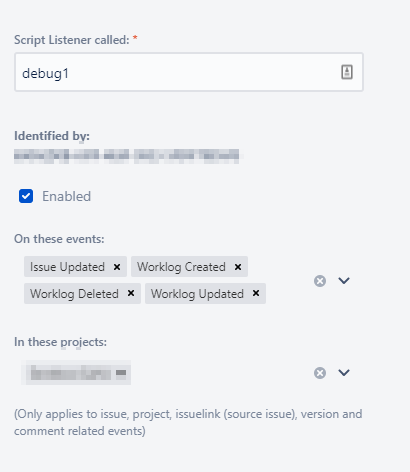

# 2020-04-10 Scriptrunner tips for Jira Cloud

## What objects are available for Scriptrunner in Jira Cloud?

One of the most important things for creating a script listener is to understand that **different** objects are returned depending on what the user changes. For example, if you change the description of an issue, then the scriptlistener will have an object ```issue``` available (and you can access ```${issue.key}```)... but if you log work for an issue, then the object ```worklog``` will be available.

### Determinating whichs objects that are available

It's easy to list the available objects. Create a new ScriptListener that listens for events:



As the script, use the following contents:

```groovy
this.binding.variables.each {k,v -> logger.info("$k = $v")};
```

The output looks like:

```text
Execution history   Logs Payload    Close
2020-04-09 07:04:35.555 INFO - config = null
2020-04-09 07:04:35.574 INFO - logger = org.slf4j.impl.Log4jLoggerAdapter(com.adaptavist.sr.cloud.MainHandler)
2020-04-09 07:04:35.575 INFO - baseUrl = https://SITENAME.atlassian.net
2020-04-09 07:04:35.577 INFO - event = <...Event data>
2020-04-09 07:04:35.594 INFO - eventId = aaaaaaaa-1111-2222-3333-444444444
2020-04-09 07:04:35.596 INFO - issue = <... Issue data>
2020-04-09 07:04:35.597 INFO - issue_event_type_name = issue_updated
2020-04-09 07:04:35.614 INFO - changelog = [id:12345, items:[[field:Story point estimate, fieldtype:custom, fieldId:customfield_10016, from:null, fromString:98, to:null, toString:97]]]
2020-04-09 07:04:35.614 INFO - webhookEvent = jira:issue_updated
2020-04-09 07:04:35.615 INFO - user = <... user data>
2020-04-09 07:04:35.634 INFO - timestamp = 15864158736
````

### Detecting if objects exists

```groovy
// Do we have an issue object?
if (binding.hasVariable("issue")) {
    logger.info("We have an issue object");
} else {
    logger.info("The issue object is missing");
}
```

## Enjoy

:)
