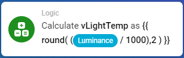

# 2020-03-08 Manage the Homey from PC only

## How hard can it be? :)

This applies to Homey 4.0 and the UI released at 2020-03-08 using Chrome.

Well, most user interfaces are supported now, if you look for them.

## All current links

* [Flow](https://flow.homey.app/)
* [Apps](https://homey.app/sv-se/apps/)
* [Insights](https://insights.homey.app/)
* [Developer](https://developer.athom.com/)
* [HomeyScript](https://homeyscript.homey.app/) (needs additional permissons and installed app)

## Homey Flow

Can be found at [https://flow.homey.app/](https://flow.homey.app/) and most of the functions can be used without problems from the UI. But there are exceptions:

### Logic

You cannot write Logic that calculates variables; for some reason this only works when creating the card from the mobile client.



### Running tests

Sometimes it works in Chrome, sometimes it doesn't. On mobile it always works.

## Adding devices (aka Pairing)

Easy, go to [https://developer.athom.com/tools/pair](https://developer.athom.com/tools/pair).

To unpair, change "Pair Type" to "Unpair"

## Application settings

Some apps have their specific settings page. This can be found at [https://developer.athom.com/tools/app-settings](https://developer.athom.com/tools/app-settings).

## Variables

Now, this is more complex. Viewing is possible, but adding needs to be done using the mobile client.

To view run a script to list your variables. Go to [https://developer.athom.com/tools/api-playground](https://developer.athom.com/tools/api-playground).

### Simplest possible

Enter this and press Run.

```javascript
Homey.logic.getVariables()
```

### Compact view

```javascript
Homey.logic.getVariables().then(
    r => Object.keys(r).map(item => (
            {
                name: r[item].name,
                value: r[item].value
            }
        )))
```

### Filtering

Any javascript method can be applied, as:

```javascript
Homey.logic.getVariables().then(
    r => Object.keys(r).map(item => (
            {
                name: r[item].name,
                value: r[item].value
            }
        )).filter(item => item.name=== "vLightTemp")
        )
```
