# 2020-03-01 Configure the SPC Bridge

## Overview

This guide describes how to configure the integration of an SPC Alarm system, the [SPC Bridge](https://www.lundix.se/smarta-losningar/) and Homey.

## Configure the SPC Bridge

Logon to the SPCBridge (might be on <http://spcbridge.lan>). Default username&Password is root/dragino (change it if so!)

Enter and make a note of:

* Generate and enter an encryption key (Good site: <https://www.grc.com/passwords.htm>)
* Enter SPC Username. This guide uses "lundixuser"
* Generate an SPC Password and enter it.

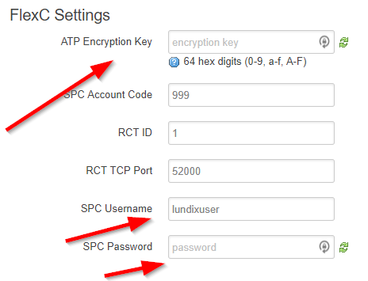

## Setup SPC Alarm System

You can login to the SPC Alarm system using one of these methods.

:!: You might not have access to your alarm system, talk to your provider.

:!: The username is case sensitive!

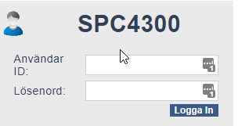

### Method 1: SPCConnect.com

Login using SPC Connect.com. Now, the connect to the "SPC Central" is located in different places depending on the version. It's looking like this: 

## Method 2: Connect directly to the alarm system

* Note 1 – Chrome has some troubles with this method. Use Internet Explorer.
* Note 2 – You need to know the address by yourself

Logon to <https://SpcCentralUnit.lan/> or <https://IPADDRESS/>

## Switch to “Full Engineering” mode

After logging in - In the upper right, switch to “Full Engineering” mode. If you
don’t have this option, choose to login with an account that has this right.


## Add User

Go to Users. Add a user named “lundixuser”. Set a pin code of your choice.

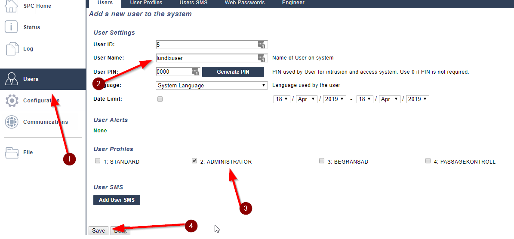

## Create a web password

The only way to set a web password is for the user *himself* to do it. So begin
with exiting the “Full Engineering mode” and click “Logout”

Next, login with the user “lundixuser” and the pin code (once a web
password has been set the pin code is of no use anymore, use the web password).

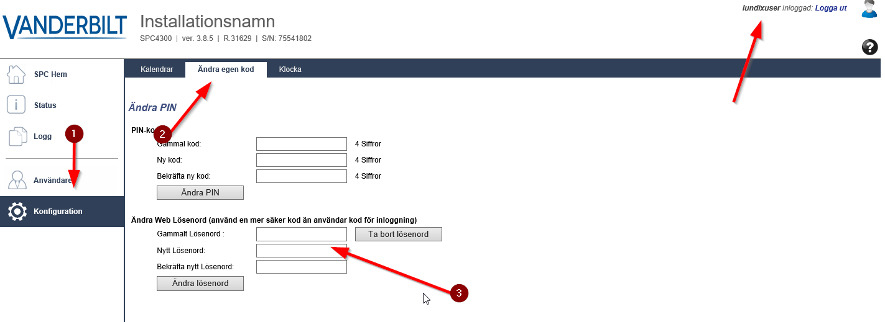

Set a password and logout.

## Add “Event Profile”

Relogin as Engieer again and enable “Full Engineering Mode”. Next choose
Communications => FlexC => Event Profiles and “Add”

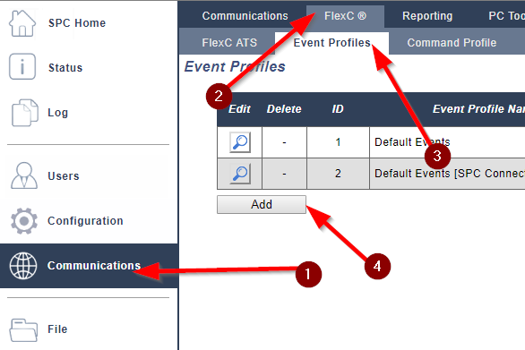

Add “Lundix Events”. Make sure all “Report Event” checkboxes are checked.

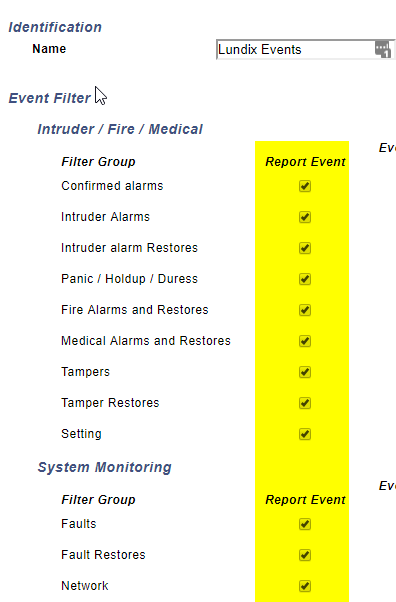

Also make sure all area filters are selected.

## Configure “FlexC ATS”

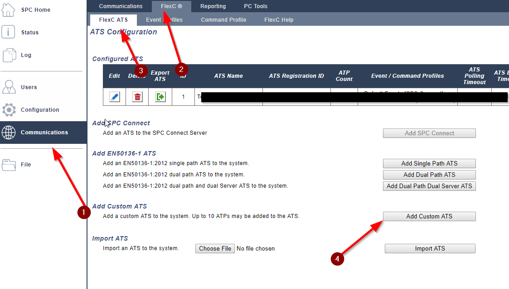

Selecting “Add Custom ATS”. Allow all settings to be default, except the
following:

* ATS Name: “Lundix ATS”
* Event Profile: “Lundix Events” (previously created above)
* ATS Polling Timeout: “60”
* Generate FTC: Unchecked
* Re-Queue Events: Unchecked

Next click “Add ATP to FlexC RCT”

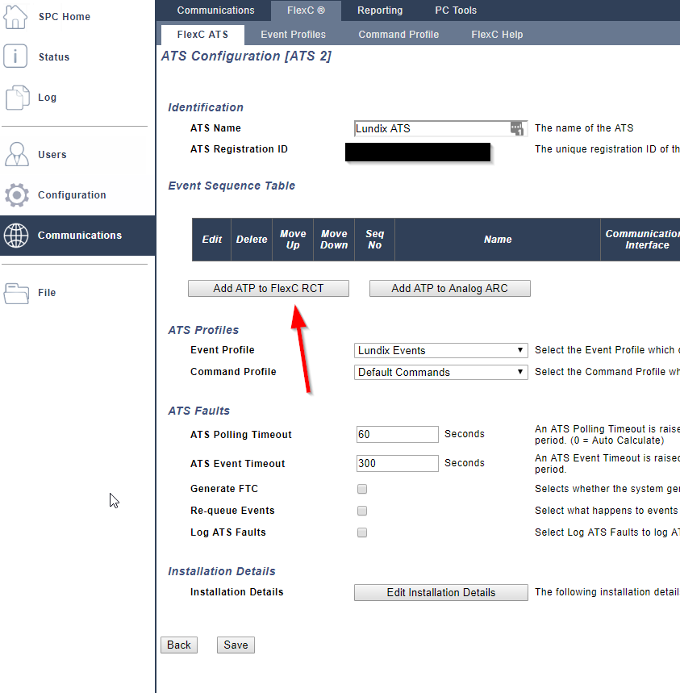

## Continue configure:

In order to complete the “ATP Configuration – FlexC RCT” you need:

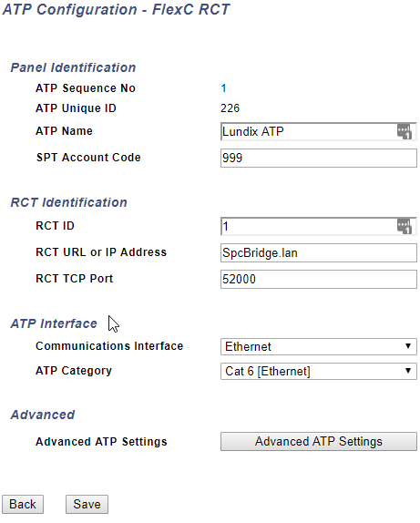

Next, click “Advanced ATP Settings”. Allow all settings to be default except
encryption mode and key.

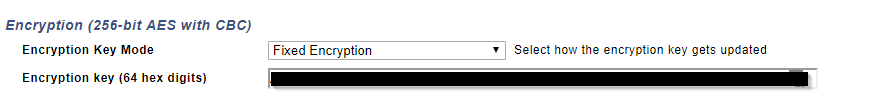

Save all. You should now be able to see a newly configured ATS.

## Verify communication between the SPC Alarm system and the SPC Bridge.

Login to the spcbridge and go to the test menu. The JSON reply should look something like:

```json
{
   "status":"success",
   "data":{
      "area_status":{
         "area_id":"1",
         "area_name":"XXXX",
         "mode":"0",
         "partseta_enable":"1",
         "partsetb_enable":"0",
         "partseta_name":"XXXX",
         "last_set_time":"1582920663",
         "last_set_time_spc":"19110328022020",
         "last_set_user_id":"1",
         "last_set_user_name":"XXXXX",
         "last_unset_time":"1583057829",
         "last_unset_time_spc":"09170901032020",
         "last_unset_user_id":"9",
         "last_unset_user_name":"XXXXX",
         "last_alarm":"1576405343",
         "last_alarm_spc":"09222315122019",
         "not_ready_set":"10006",
         "internal_bells":"0",
         "external_bells":"0"
      }
   }
}
````

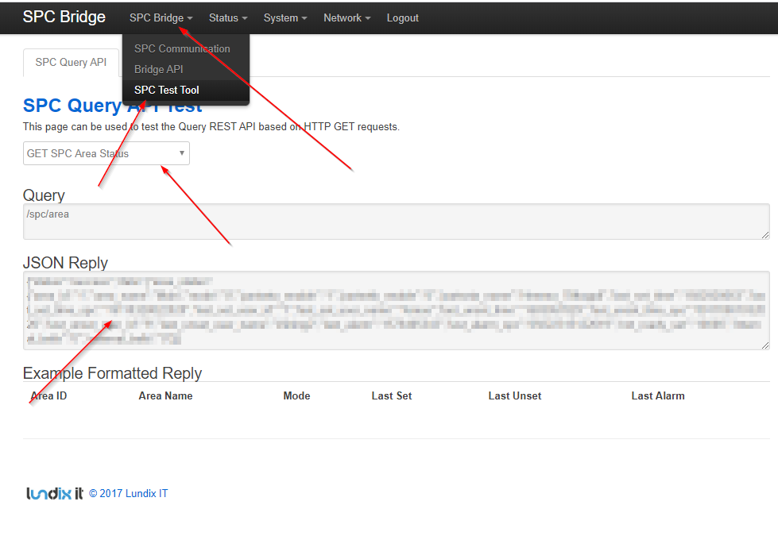

Go to Status => Flex C and view your configured ATS.

## Troubleshooting

Go to SPC ==> Status ==> Flex C ==> Your new ATS ==> and review the logs (Event log and Network log).

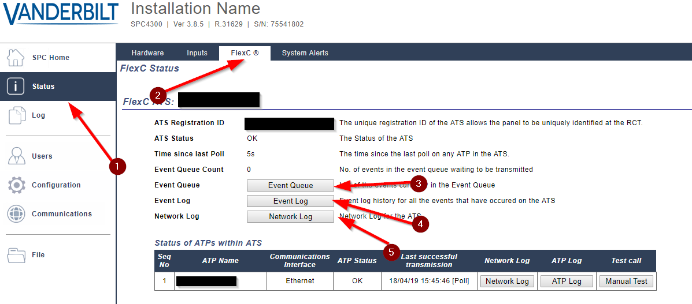

## Preparing SPC Bridge for Homey access

Homey can access the SPC Bridge with three different calls:

* *HTTP GET* method is used to QUERY the SPC for information (such as "what's the status of the alarm")
* *HTTP PUT* method is used for sending COMMANDS to the SPC (such as "turn on alarm")
* *Websockets* are used for listening on SPC EVENTS (such as alarm turned on/off)

Depending on your desired outcome, you can configure either all three (full access) or limited (read only). Full access means it will be possible to turn off the SPC Alarm system using your scripts (or even Google Assistant), but it will also open your alarm system for attacks. Be cautious.

Go to the SPC Bridge and enter a password for the events you intend to use:

* For readonly, create a password for get_user and ws_user
* For full access, create all three passwords

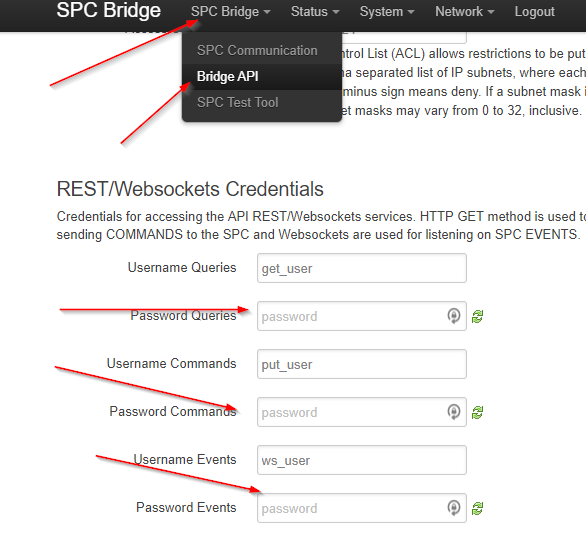

## Configuring Homey

The final step is to configure Homey. Begin with installing the [Vanderbilt SPC Intrusion Detection System](https://homey.app/sv-se/app/com.vanderbilt.spc/Vanderbilt-SPC-Intrusion-Detection-System/) App to Homey.

Next, in the Homey app, go to Devices ==> Add device ==> Vanderbilt SPC Intrusion Detection System and select to add an "Alarm Panel".

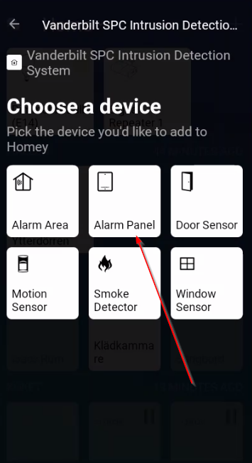

Confirm you want to install and on the next screen enter the passwords previously setup in SPC Bridge:

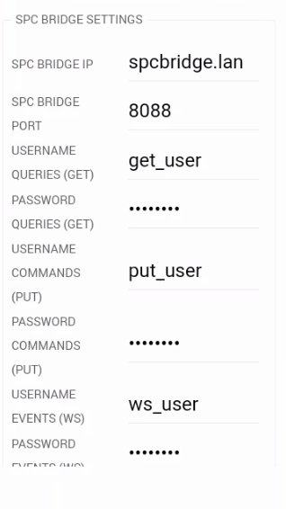

Scroll down and click next and patiently wait for the import to complete (this takes some 10 seconds and there is no progress bar).

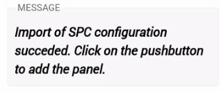

## Enjoy

Now the connection between Homey, SPC Bridge and the SPC Alarm system is complete.

:)

## More information

* [SPC Connect Configuration Manual.pdf](SPC%20Connect%20Configuration%20Manual.pdf)
* [SPC-Bridge-User-Manual-version-1.0.pdf](SPC-Bridge-User-Manual-version-1.0.pdf)
