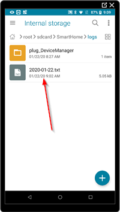
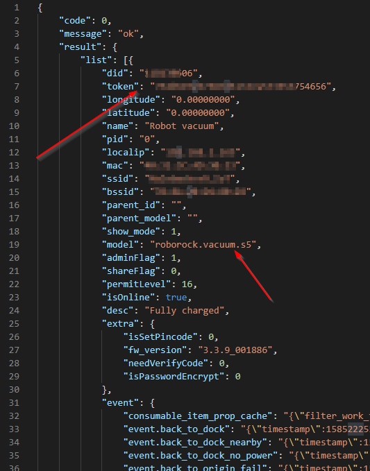

# 2019-01-22 Getting the Roborock token

There are a number of ways of fetching the token, but this document focuses on a quick way to do it. If you want much more information, go to [this](https://github.com/Maxmudjon/com.xiaomi-miio/blob/master/docs/obtain_token.md) site.

## Install the Xiaomi App

* From the phone, download the [com-xiaomi-smarthome-5.4.54.apk](https://android-apk.org/com.xiaomi.smarthome/43397902-mi-home/) file. It will end up in the "Downloads folder"
* Uninstall your current Xiaomi Mi Home app (if you have it).
* Open File Manager on the phone, navigate to "Downloads".
* Now, clicking the downloaded file will prompt a security warning. You need to allow to install from unknown sources.
* Open the app

## Getting the Roborock token

* Start the "Mi Home" app and login with your Xiaomi account.
* Open the Robot Vaccum (this will write a log in the file system)
* Close the app and open a file explorer (File Manager)
  * Note, you must do this from the phone - in Windows the folders will be empty.
* Navigate to ```/sdcard/SmartHome/logs/Plug_Devicemanager/```
* Open the latest logfile you can find



* Search the log for token:

```JSON
SmartHome 2082144:[DEBUG]-01-22 09:02:32.187 processResult in result={"code":0,
"message":"ok","result":{"list":[{"did":"118130606",
"token":"754aaaaaaabcdefabcdefabce2345671","longitude":"0.00000000",
"latitude":"0.00000000","name":"Robot vacuum","pid":"0","localip":...
```

Note, make sure you pick the right token, *all* Xiaomi devices (and tokens) you have will be listed in the log file.


