# 2015-05-25 Setting up Konica Minolta C224e to scan directly to your computer

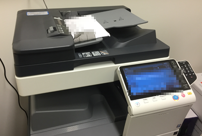

## Preparation

### Get your computer name (needed below)

Go to Control Panel System And Security System.

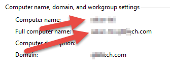

Write down the “Full Computer Name.”

## Computer Setup

### Create ”Scanned” folder

Create a folder on your desktop. Right click and choose “Properties”. Select the
“Sharing” tab and click “Advanced Sharing…”

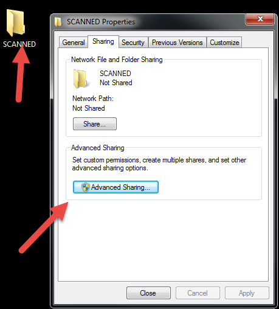

Tick the “Share this folder” checkbox and click the permissions tab.

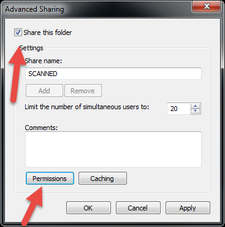

Remove everyone and click “Add…”

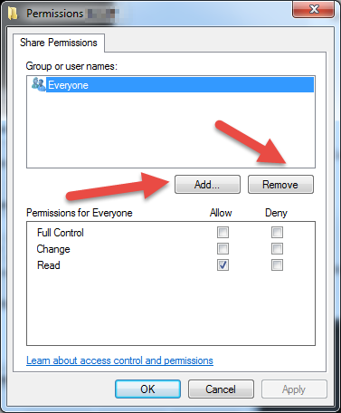

Add yourself and click OK.

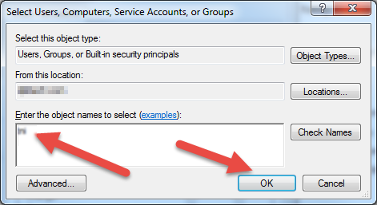

Tick “Full Control” and “Change” so all three checkboxes are checked. Click OK.

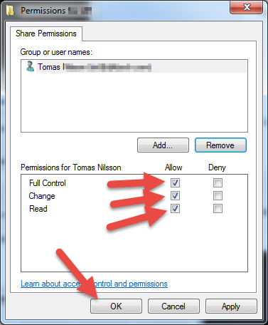

Now your computer target folder has been configured.

## Test it :)

Test by opening a file explorer (Press the Windows+E on the keyboard).

Type in the address to your computer name and the name of the share in the
following format:

```\\COMPUTERNAME\FOLDERNAME```

For the test, you can use either the “Computer Name” or the “Full Computer
Name”. Both should work. This example shows my computer with my folder.


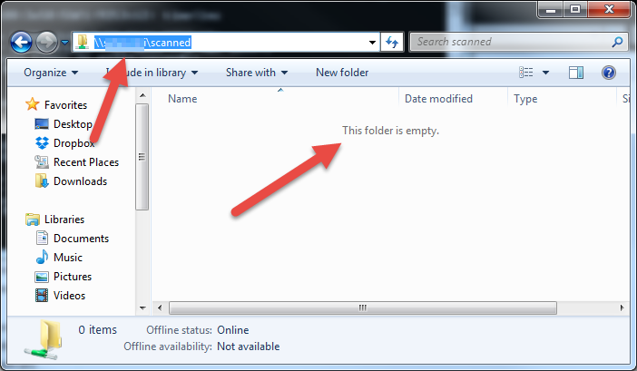

If you want to, create and delete a test file here. It should work without
errors.

## Printer setup

Now it’s time to setup the printer.

### Find the address to the printer

On the start menu, go to “Devices and Printers”. Right click the printer and
select “Printing Preferences”

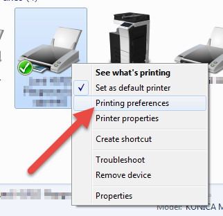

Click “Printer Information”

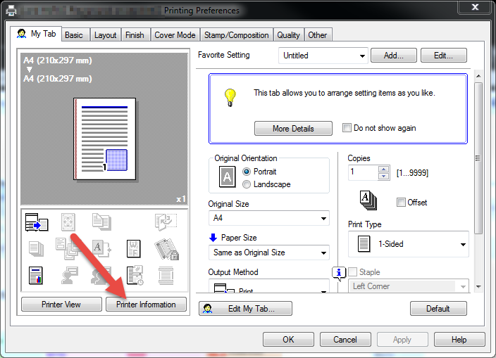

A web browser will open (Tip! Save this link!)

Click “Store Adresses” and the click “New Registration”.

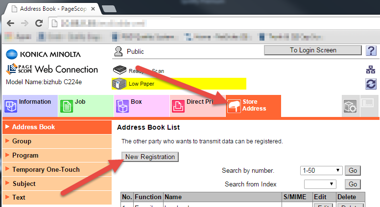

Choose SMB and click OK.

Begin with entering your name and select the tab where your name should be on the printer:

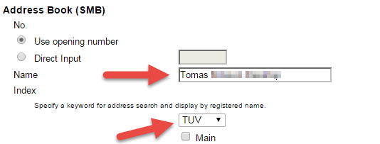

Next, enter the following:

* **Please check to enter host name** : Check it
* **File Path**: This must be the name of the folder you shared. Please be careful with uppercase / lowercase
****Username**: This is your username only. Do not enter domain information or similar, doing that doesn’t work.
** **Password**: This is your password.

**Before clicking OK…** - Make sure nobody is printing, you cannot save if the printer is in use!

### Test it :)

Go to the printer and click “Fax/Scan”. Choose your profile under the shown buttons.

Insert a paper and click the start button. Wait 30 seconds at the scanner - if no error appears, the file has been successfully scanned directly to your computer.

The transfer to your computer is slow. This will be especially noticeable when scanning multiple files and/or scan many pages. Be patient, the files will appear.
