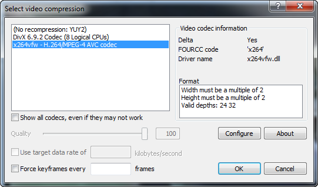
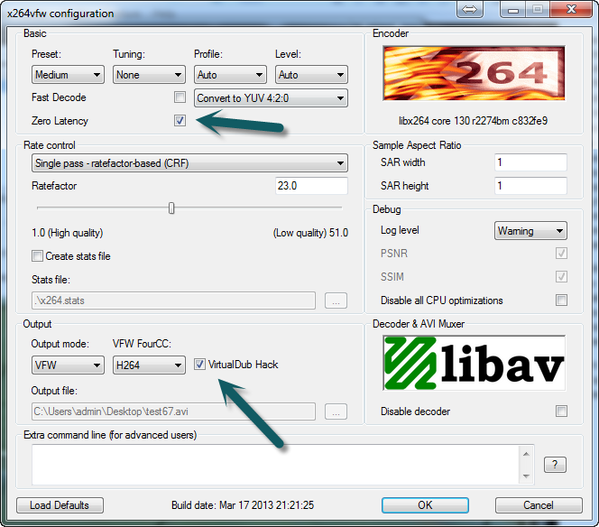
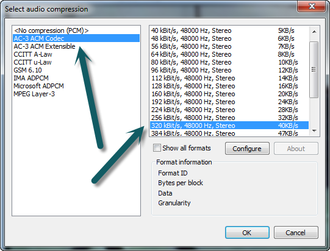
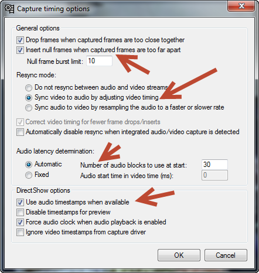
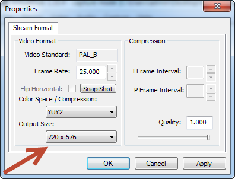
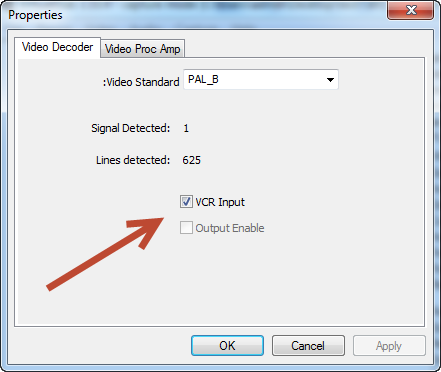
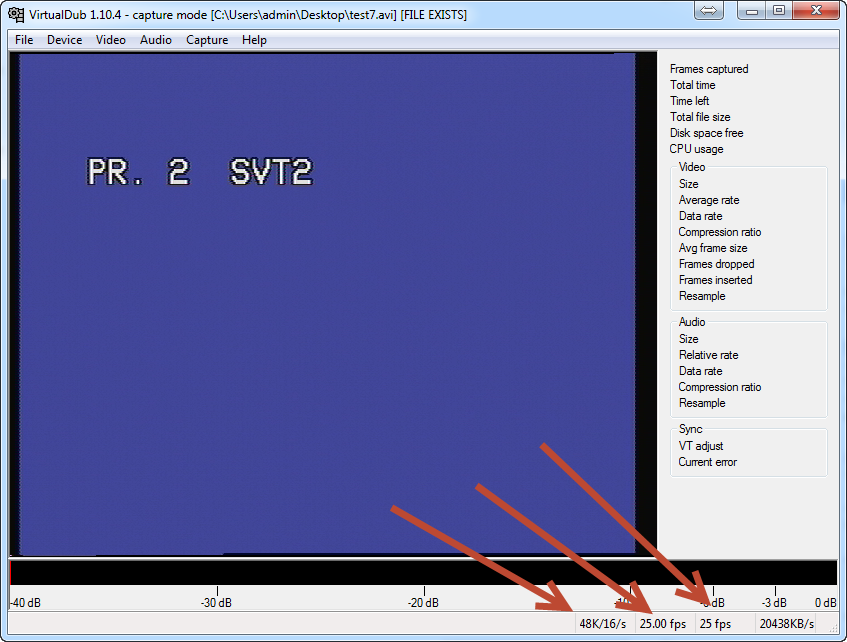
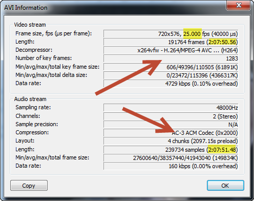

:!: This article is super old and may not apply. Still, it did take me many tries to get it right, so it might give some hints.

## How to properly capture from VHS

### Install x264 VfW codec

[http://sourceforge.net/projects/x264vfw/](http://sourceforge.net/projects/x264vfw/)

Note: Make sure you get the VfW version of the x264 codec. If you download the .exe version, you'll have to use it through a command line, which I won't cover here and is a bit more technical. VfW stands for Video for Windows. It basically
means you can use VirtualDub instead of the command line.

### Download AC3

[http://www.videohelp.com/download/AC3ACM22.zip](http://www.videohelp.com/download/AC3ACM22.zip)

Install as administrator!

### Download and unpack VirtualDub (if you lack codecs, try the 32 bit version)

* Go to File --\> Capture AVI
* Device --\> Choose your capture device
* File --\> Set Capture File
* Choose Video --\> Compression --\> x264vfw. Optionally use "configure".









Capture Pin



Capture Filter



Audio -\> Windows Mixer

Decrease levels!


<http://www.fourcc.org/codecs.php>



## Correcting Audio Drift

It's possible to change the audio speed on the movie *without* reencoding it.



Find out the length in seconds + current framerate:

Example:

* Video: 7670.056, 25.0000
* Audio: 7671.048

Calculate new framerate (changing dwRate and dwScale):

They will be:

* VideoLenght*OldFrameRate = 191750
* Reuse the audio length: 7671

Next, use [AVIFRATE.EXE](https://www.dropbox.com/s/aeu4gkk23byob53/AVIFRATE.EXE?dl=1)

```batch
AVIFRATE.EXE movie.avi -setfps 191750 7671
```

to set a fps of 24.997 use:

```batch
AVIFRATE.EXE movie.avi -setfps 24997000 1000000
```

Avifrate [homepage](http://www.am-softhome.com/avifrate.html)
