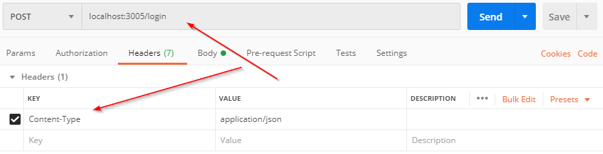

## Introduction

This article will demonstrate how to make a simple and efficent implementation in an API written in NodeJS/Javascript using express and [jsonwebtoken](https://www.npmjs.com/package/jsonwebtoken).

There are many articles on the subject, but the TL;DR; version are: "JWTs are similar to a drivers license. Someone issues it, and gives it to the user. On request, the user shows the ID as proof. Once the license is issued it's actually quite hard to revoke it (since it's the *user* that has this proof)."

In better terms the "drivers license" is called a JWT token (aka Bearer) and the "ID" is called claims.

Consider the following code:

```javascript
const jsonwebtoken = require('jsonwebtoken');
const signingpassword = "dfhjkafhaebHbhjb2jhbHJ";

let jwtcontents = {
    username: "thisismyusername",
}

let jwt = jsonwebtoken.sign(jwtcontents, signingpassword, { expiresIn: 3600 });

console.log(jwt);
```

Running this will produce something as ```eyJhbGciOiJIUzI1NiIsInR5cCI6IkpXVCJ9.
eyJ1c2VybmFtZSI6ImFkbWluIiwiaWF0IjoxNTg1MDQyMzgwLCJleHAiOjE1ODUwNDU5ODB9.
POpmV8sQNU4VrqI8ZbRGd4GBUdEuPhmDVIGci5EPSNY```.

1. JWTs are encoded, but can easily be decoded. For example, check out [https://jwt.io/](https://jwt.io/)). Also note the two "." inside the JWT which indiciates the three internal parts.
2. JWTs are signed to ensure the contents isn't modified
3. If you're using the JWT for login purposes, make sure you don't leak it. Anybody with the JWT will be able to authenticate as the JWT owner.

## API: Implementing /login

In order to issue an JWT, you must implement a ```/login``` call. It can be something as simple as this (note, you need password to sign your token with, in this case stored in ```config.jwt.key```.)

```javascript
  app.post(`/login`, (req, res) => {

        const { username, password } = req.body;

        if (!(username && password)) {
            res.status(401).json({ error: "Need username and password" });
        }
        else {

            // Fake user login :)
            // let user = userlist.find(username);
            let user = {
                login: () => { return true; }
            }

            if (user && user.login(password)) {

                let jwtcontents = {
                    username: username,
                }

                let jwt = jsonwebtoken.sign(jwtcontents, config.jwt.key, { expiresIn: 3600 });

                res.json({ token: jwt });
            }
            else
                res.json({ message: "Bad username or password" });

        }

        res.end();

    });
```

## Client: Fetching the JWT

This example uses a body, so just parse it. It's also common to return the JWT in the headers instead (using res.headers).

If you want to examine the contents of the token using another jwt library called [jwt-decode](https://www.npmjs.com/package/jwt-decode), the code could look like this:

```javascript
    let result = makethecall("/login", "admin", "password");
    console.log(jwtDecode(result.token));
```

Store the JWT as *all* subsequent calls to the API will pass this variable (use a cookie).

## Client: Sending the JWT to the API

Now the client has gotten the JWT. Sending it back to the API should **use headers in the form of**:

```text
GET / HTTP/1.1

Authorization: Bearer THEJWTTOKEN
```

## API: Catching the token

Using express you can register a middleware that processes all incoming requests. So a call to "/faq/article/1" would first pass through this code and try to decode the token. If successful, set req.me (and if not, leave it undefined).

```javascript
app.use(function decode(req, res, next) {

    let result = decodeToken(req);  // See below on the gettoken call
    if (result) {

        // console.log("setupInterceptMiddleware():\tA valid token was found: Decoded result=" + JSON.stringify(result));

        // This is a neat trick :) Why? See /ping1 call
        req.me = {
            username: result.username
        }
    }
    next();
});

function decodeToken(req) {

    let result;

    if (req.headers.authorization && req.headers.authorization.split(' ')[0] === 'Bearer') {

        // Get the JWT
        let token = req.headers.authorization.split(' ')[1];

        // Verify the token (make sure it's not modified) using our secret key
        try {
            result = jsonwebtoken.verify(token, config.jwt.key);
        } catch (error) {
            console.log("decodeToken(): Could not verify & decode token. Error=" + error);
        }
    }

    return result; // Return undefined if not found/not valid
}
```

## API: Just allowing authenticated calls

Now this is where the magic happens.

If the client supplies a valid JWT, then the current request (req) will contain the username in ```req.me.username```.

```javascript
function OnlyAuthenticatedMiddleware(req, res, next) {

    // If the token was decoded properly, then run next()
    if (req.me && req.me.username) {
        next()
    }
    else {
        // Sorry, you need to authenticate (error 401)
        res.status(401).json({ error: "Token expired" });
        res.end();
    }
};
```

To use this

```javascript
app.get(`/ping1`, OnlyAuthenticatedMiddleware, (req, res) => {

    // Try to access this code with both a valid and an expired token (the latter will fail
    // because it passes the middleware OnlyAuthenticatedMiddleware).

    console.log(`/ping1: Username=${req.me.username}`);
    res.json({ pong: `Hello from ping1. Username=${req.me.username}` })

});

app.get(`/ping2`, (req, res) => {

    // Try to access this code with both a valid and an expired token (both will work,
    // but without logging in "Hello guest" will be returned)

    if (req.me && req.me.username) {
        console.log(`/ping2: Username=${req.me.username}`);
        res.json({ pong: `Hello from ping2. You are authenticated with username=${req.me.username}` })
    }
    else {
        console.log(`/ping2: Username not found (no valid token)`);
        res.json({ pong: `Hello guest` })
    }
});
```

## The full code

```javascript
<% include_relative minijwt.js %>
```

### Executing /login



with payload:

```json
{
	"username": "a",
	"password": "b"
}
```
## Advanced topics

### Implementing logout

Now, this is complicated. Once a JWT has been issued, you cannot invalidate it. The only way make an immidate logout is to blacklist the JWT in the API and it needs to be blacklisted until you know the token expires on the client side.

### Keeping the client logged in

There are a number of ways you can keep the client logged in, where the most obvious one is to use long expire times for the token. This does have some troubles, since keeping track of blacklisted tokens needs a bigger database and a couple of other minor issues (like the token beeing stolen)

There is a really good article on the subject [here](https://medium.com/kaliop/3-ways-to-automatically-renew-an-user-session-per-token-jwt-552616e1f094).

## Enjoy

:)
