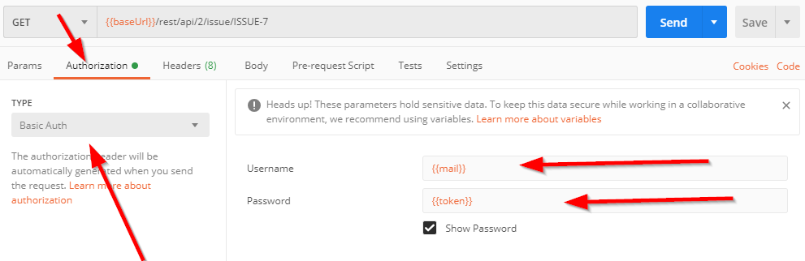
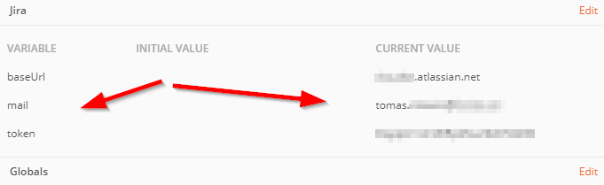
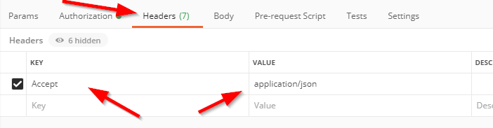

## Token or ..?

Basic authentication is going away, so grab a token from [
https://id.atlassian.com/manage/api-tokens](
https://id.atlassian.com/manage/api-tokens).

Important! You still pass these parameters as Basic Authentication in Postman, but rather than Email+Password, you pass Email+**API Token**. And to maybe solve some more confusions, the documentation for how to authenticate has a number of bad examples floating around. If you want to know all about it, read [this](https://jira.atlassian.com/browse/JRACLOUD-72405) article.

## Make your first request

Testing in curl is always good :)

```text
curl https://SITENAME.atlassian.net/rest/api/2/search -u "EMAIL:THETOKEN"
```

This one should return all items from Jira.

## Postman

Configure Authorization:



Click the eye and create the variables:




And headers.



## More information.

Read [this](https://blog.developer.atlassian.com/creating-a-jira-cloud-issue-in-a-single-rest-call/).

## Collections?

There is a collection available, but it doesn't work. See [https://developer.atlassian.com/cloud/jira/software/swagger.v3.json](https://developer.atlassian.com/cloud/jira/software/swagger.v3.json)
