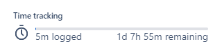
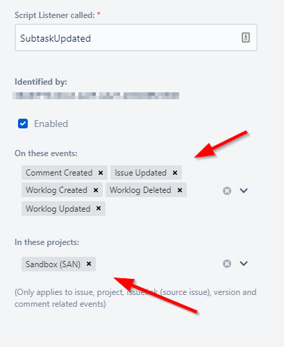

## Jira Cloud & NextGen projects limitations

NextGen projects are good, but much stuff is built around story points (for example visualizations in the board and burn-down charts). Our team prefer to use the time tracking fields:



This document describes how to use the time tracking fields to update the story points of the parent issue :)

## Prereqs

In order for this script to function you need a number of things in place in Jira:

* Scriptrunner must installed (see marketplace)
* There is a NextGen project with the following types (they're default):
  * Story
  * Subtask

The Story has been configured to have the Story Points field, and the Subtasks has been configured to have the Time Estimate fields.

## Debugging the script

Since two instances of Jira might be slightly different (for example naming of fields), it's a good idea to make a testrun first.

In Jira, go to Manage Apps [https://SITENAME.atlassian.net/plugins/servlet/upm](https://SITENAME.atlassian.net/plugins/servlet/upm)

Next find the "ScriptRunner" ➡ "Script Console". Copy and paste the follwing script (don't forget to change the first line to match an existing subtask).

Click "Run" and examine the Logs.

```groovy


```

Log result:

```text
Serializing object into 'interface java.util.Map'
GET /rest/api/2/issue/SAN-16 asObject Request Duration: 3161ms
SAN-16 (Subtask) was updated.
Found subtask; parent = SAN-8
Serializing object into 'interface java.util.Map'
GET /rest/api/2/search asObject Request Duration: 755ms
Total subtasks for SAN-8: 5
SAN-16
SAN-15
SAN-14
SAN-13
SAN-12
15
Serializing object into 'interface java.util.List'
GET /rest/api/2/field asObject Request Duration: 604ms
Story Point field found: customfield_10016

Storing 15 Story Points into SAN-8...

PUT /rest/api/2/issue/SAN-8 asString Request Duration: 625ms
All done.
```

## Updating on subtask was changed

Go to "ScriptRunner" ➡ "Script Listeners". Click "Add Listener" and setup a listener. Setup when you want to trigger the script and which projects it should run for:



Next, store the script context and save. Edit a subtask and view if the parent was updated.

```groovy

```

## Double logs?

Well, if you have triggers to run on "issue updated", then the script will run when updating a subtask. But the script in turn will update the Story, so the script will run again.


This is reflected in the log as:

```text
2020-04-03 19:25:56.937 INFO - SAN-8 (Story) is processed...
2020-04-03 19:25:56.938 INFO - - Skipped (not a subtask)
```

So always read the previous run :)

## Enjoy

:)
