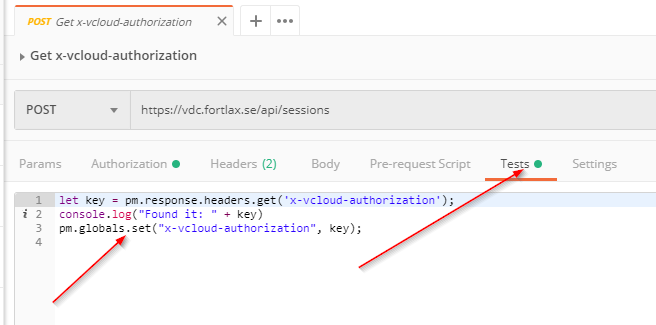

## Fetching bearer and storing to global variable (from headers)

To add scripts to execute after a request has completed, just go to the "Tests" tab.



```javascript
let key = pm.response.headers.get('x-vcloud-authorization');
console.log("Found it: " + key)
pm.globals.set("x-vcloud-authorization", key);
```

## Fetching bearer and storing to global variable (from body)

If the returned body looks loke:

```json
{
    token: "abc123"
}
```

then this script works:

```javascript
let body = pm.response.json();
let token = body.token;
console.log("Found it: " + token);
pm.globals.set("token", token);
```

## Using global variables

Global variables can be viewed in the top right eye  .

To use them, just reference then with double brackets as {{x-vcloud-authorization}}. Example:


## Enjoy.

:)
