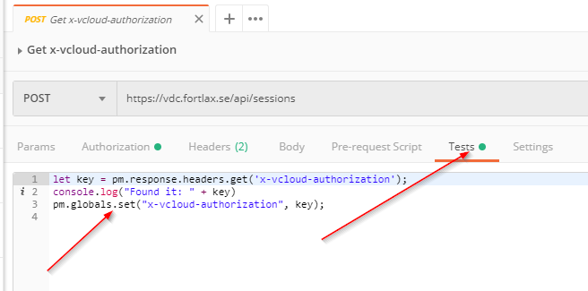
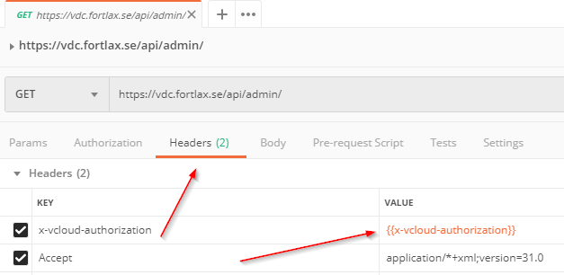
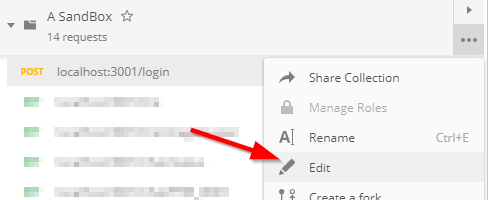
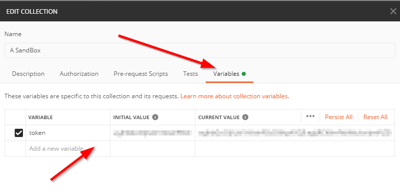

## Fetching bearer and storing to global variable (from headers)

If you execute /login, and it in turns a token (like a bearer) that you want to utilize through the built in Postman variables, then this is the article fo you.

## Executing scripts after the request completes

To add scripts to execute after a request has completed, just go to the "Tests" tab and add your script there.



## Using global variables

Use variables is as easy as referencing them with double brackets as ```{{variablename}}```.



## Review/manually modify variables

### Global/Environment variables

Global and Environment variables can be viewed in the top right eye  .

### Collection variables

Edit the collection and choose variables tab.





## Parsing requests

Since tests are executed after a request has been completed, fetching any tokens can be as easy as:

### Tokens in headers

```javascript
let key = pm.response.headers.get('x-vcloud-authorization');
console.log("Found it: " + key)
pm.collectionVariables.set("x-vcloud-authorization", key);
```

## Tokens in the body

If the returned body looks loke:

```json
{
    token: "abc123"
}
```

then this script works:

```javascript
let body = pm.response.json();
let token = body.token;
console.log("Found it: " + token);
pm.collectionVariables.set("token", token);
```

## Storing variables from code

As [documented](https://learning.postman.com/docs/postman/variables-and-environments/variables/), variables can exist on the collection, on the environment or globally. To store a value use one of the following:

```javascript
pm.globals.set("variable_key", "variable_value");
pm.collectionVariables.set("variable_key", "variable_value");
pm.environment.set("variable_key", "variable_value");
```

## Enjoy.

:)
