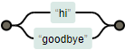

## The most important about regex

It's hard to read, but by visualizing it, it will become understandable. I strongly recommend [https://regexper.com/](https://regexper.com/).

### Example

```text
^hello, (world|moon)\\.$
```


## The regex basics

| **Character** | **Description** | **Example** | **Result** |
|--|--|--|--|
| \ | Escapes the next character (so \\n matches newline) | \\n |  |
| ^ | Matches the beginning of input | ^hello |  |
| $ | Matches the end of input. | hello$ |  |
| * | Matches the previous character zero or more times. "te*" will match "te", "tee", "teee", "teeee" and so forth. | te* |  |
| . | Matches any single character | hel.o |  |
| .\ | Matches any string from zero character to "unlimited length". | hel.*o |  |
| + | As with * it matches the previous character, but *one* or more times. | hel+o | 
| ? | Matches a single character zero or one time. | hel?o |  |
| x\|y | Matches either x or y | hi\|goodbye |  |
| (x\|y) | Matches either x or y  | (hey\|hello) world! |   |
| [xyz] | Matches any one of the characters inside of the brackets. Ranges are possible. | [abck-z] |  |
| \d | Matches a digit. Equivalent to [0-9]. |

## More examples

* /\\(([^)]+)\\)/
* ^.*$
* ^[A-C][a-zA-Z0-9]{4}$
* {([A-Za-z]+)+([a-z]+)}
* ^\\w$

Try them all in [https://regexper.com/](https://regexper.com/).

## Learn it!

There's tons of resources for learning rexex, for example this one:

* [https://regexone.com/](https://regexone.com/)
