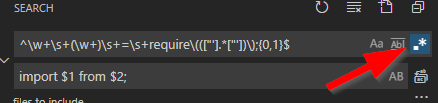
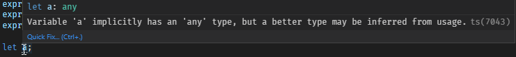

In order to convert an existing project to Typescript and still avoid insanity, there's a number of steps to follow.

I also recommend you check out the [Empty Project](../EmptyProject/index.md) guide, there's a lot more details there.

# Step-by-step approach

This document begins with establing a typescript with "compile-no-errors" setup (retaining all files as .js). One step at a time, we'll then resolve the found issuesand finally become very much typescript-only (.ts-only)

Begin with opening your existing project (if you want to start fresh, then read the EmptyProject guide on this site).

Also, it's worth mentioning that typescript ```transpiles``` (rather than ```compiles```) from typescript (which is more or less javascript) to javascript (to the version of your choosing, but this guide focuses on ES2020 compability level).

# Phase 1 - Establishing the toolchain

## Install Typescript tools

Begin with installing ```tsc`` (the transpiler) and typescript.

```bash
npm install typescript -s
npm install tsc -g
```

## ts-node

```node.exe``` has been running your nodeproject, but it doesn't understand typescript out of the box. There are two methods:

* Using ```ts-node``` instead of ```node```
* Still use ```node``` with a modified parameters list

Install ts-node

```bash
npm install ts-node -g
```

## nodemon

nodemon is commonly used (it runs your project from command line and automatically restarts the program on any source code change)

```bash
npm install -g nodemon
```

## Eslint

Well, this is an important one not covered by this document :)

# Phase 2 - Configuring your project for typescript

## Create tsconfig.json (or maybe "movingtotypescript.json")

Now, most guides recommend to create a ```tsconfig.json```, but *for now* I recommend naming it something different like ```movingtotypescript.json```. Why? Because once you've created it, vscode starts to behave differently (especially in the number of errors reported). Naming it properly of course has it's advantages if you plan to convert "now" (and your project is small), but if the conversion is one of the reasons listed, I'd go slow:

* Large project (cannot be converted in less than a day)
* Doesn't want to affect team members until many errors has been resolved
* Want control of the conversion process
* Know there's javascript errors (that can be resolved in javascript) to fix before really converting

Do as you'd like. This guide uses ```movingtotypescript.json``` for the time beeing (it will be renamed below)

In the root of the project, create ```tsconfig.json``` or ```movingtotypescript.json```. Begin with this content:

```json
{
	"compilerOptions": {
		"target": "ES2020",
		"module": "commonjs", /* 'commonjs', 'es2015', 'es2020', ... */
		"outDir": "out",
		"rootDir": "src",
		"strict": true, /* Enable all strict type-checking options. */
		"noImplicitAny": false, /* Raise error on expressions and declarations with an implied 'any' type. */
		"strictNullChecks": false,
		"checkJs": true,
		"allowJs": true,
		"types": [
			"node"
		],
		"lib": [
			"dom",
			"es6",
			"es2017"
		],
		"esModuleInterop": true,
		"skipLibCheck": true,
		"forceConsistentCasingInFileNames": true
	},
	"include": [
		"src/**/*.js",
		"src/**/*.ts"
	]
}
```

### Some notes on the config settings

#### "target": "ES2020"

If you're doing backend development and can run a newer release of ```node```, then it's most logical to use as new EcmaScript version as possible. What's cool about Typescript is that you can write your code in ES2020, and TypeScript uses various methods to turn functionality into older versions javascript.

#### "rootDir": "src"

If you follow most standards, your source code is in "src"

#### "outDir": "out"

Outdir is the destination folder. Again, Typescript is build around "compiling" into a destination directory (C#, C++ or similar developers will totally understand). As stated in the title, this document more focuses on running the code as-is (without the use of the ```outdir```), but it's still going to be needed.

#### "allowJs" && "include" - aka Transpiling javascript files

Use these settings if you want to treat .js files as .ts files (more or less, there are some minor caveats).  Depending on the error level you expect, you can modify these settings. false is less strict, true is more strict.

```json
"noImplicitAny": false,
"checkJs": false,
```

To stop treating .js as it was (more or less) .ts, change this section:

```json
	"include": [
		"src/**/*.js",
		"src/**/*.ts"
	]
```

## vscode: Force reload of ```tsconfig.json```

If you named the file ```tsconfig.json```, then vscode will process it but it's probably a good idea to force reload of vscode: Press ```ctrl-shift-p``` and search for the command ```Developer: reload window```. Use it.

## .gitignore out-folder

Using git? Modify ```.gitignore``` to exclude the ```out``` folder.

```text
out/**/*
```

# Phase 3 - Resolving errors in JavaScript (in order to prepare for next phase)

* :!: If you've disabled compilation of javascript files (above), then this step doesn't make sense.
* :!: How to resolve obvious errors will not be covered here. :)

Your current javascript files are almost guranteed to generate a ton of warnings and errors. Before going all-in to TypeScript, it's a good idea to fix many of the problems in the current javascript files.

From command line, run:

```bash
tsc -p movingtotypescript.json
dir out

# or if you've used the detfault name of tsconfig.json
tsc -p .
```

Examine the errors and try to resolve them, one by one. Also skip to Phase 4 below, because there's important information about how to run the project right now.

## Usage of global variables (TS2339)

Error:

```typescript
error TS2339: Property 'myVariable' does not exist on type 'Global & typeof globalThis'.
```

Solution:

In a .ts file, define the object. Here's some examples to get past this problem *for now*.

```typescript
declare global {
    namespace NodeJS {
        interface Global {
            myVariable: boolean,
            myClass1: Object,
            myClass2: any,
            myObject3: { Name: string, Username: string },
            myObject3Array: { Name: string, Username: string }[],
        }
    }
}
```

## Modification of Express.Request (TS2339)

If you've modified an object outside of the NodeJS namespace, then you need to find the namespace name, and the Interface you want to change.

Error:

```typescript
error TS2339: Property 'User' does not exist on type 'Request<ParamsDictionary>'.
```

Solution:

Add this at the bottom of the file where you want to modify Express:

```typescript
declare global {
  namespace Express {
    interface Request {
      User: MyUserClassInterface
    }
  }
}
```

## JSDOC Problems

Error:

```typescript
TS1064: The return type of an async function or method must be the global Promise<T> type.
```

Solution: Change

```typescript
* @returns {any}
```

..to a more Promise (optionally with a specific type):

```typescript
* returns {Promise<any>}
* returns {Promise}
* returns {Promise<boolean>}
* returns {Promise<Object>}		// For both arrays and Json
```

## Missing types modules errors

The TypeScript transpiler requires additonal modules to be installed, so called "@types". Manual install is simple, often it's just to:

```bash
# Install types for express
npm install @types/express
```

In an bigger conversion this might be time consuming, but there are tools like [typesync](https://github.com/jeffijoe/typesync) that can automatically install all missing types.

# Phase 4 - Try to run the project as-is (without transpiling)

In most guides, it's clearly setup that Typescript is built around "compiling" (read: transpiling) into a destination directory using a build step (C#, C++ or similar developers will totally understand). For the sake of simplifying debugging and giving developers a better experience, it's better to setup all tools to run typescript as-is (without transpiling to the "out" folder).

Running the code without transpiling is easy.

## From command line

```bash
ts-node src\index.js
```

... or use:

```bash
node -r ts-node/register src\index.js
```

## From vscode

Now, we haven't configured vscode yet. You need to make additional changes for this to work. Open ```launch.json``` and add the follwing. Modify args to match the name of your starting file.

```json
		{
			"name": "Debug typescript",
			"type": "node",
			"request": "launch",
			"smartStep": false,
			"sourceMaps": true,
			"args": [
				"${workspaceRoot}/src/index.js"
			],
			"runtimeArgs": [
				"-r",
				"ts-node/register"
			],
			"cwd": "${workspaceRoot}",
			"protocol": "inspector",
			"internalConsoleOptions": "openOnSessionStart",
			"env": {
				"TS_NODE_IGNORE": "false"
			},
			"skipFiles": [
				"<node_internals>/**",
				"${workspaceRoot}/node_modules/**"
			],
			"outputCapture": "std",
		}
```

Save. Press ```ctrl-shift-p``` to bring up the command palette. Search for ```Debug: Select and start debugging```. Choose it. In the menu that appears, select ```Debug typescript``` (as named above). See if it works.

## Using nodemon

I suggest to create a ```nodemon.json``` config file:

```json
{
	"restartable": "rs",
	"ignore": [
		"**/.git",
		"**/log/**"
	],
	"verbose": false,
	"env": {
		"NODE_ENV": "development"
	},
	"ext": "ts",
 	"exec": "ts-node --inspect=9229 ./src/index.js"
}
```

.. but it's very possible to just use:

```bash
nodemon ts-node --inspect=9229 ./src/index.js
```

# Phase 5 - The Deep dive (rename all files)

Now, this is where it gets interesting. Renaming the files will disable some features, and add others.

## Rename movingtotypescript.json to tsconfig.json

If you haven't done this already, do it now. Dont forget to reload vscode.

## Rename all files

With the setting of allowing js to be included, it's not *really* a must to rename the files but it's strongly recommended. Some features wont be available unless the files are named .ts. In short, please do the work to rename all ```filename.js``` to ```filename.ts``` :)

After you've done these two steps, vscode will show you all errors under "Problems"

## Remove extensions on require

Remove all .js on require. Change from:

```javascript
const logger = require("../include/myfile");
```

to:

```javascript
const logger = require("../include/myfile");
```

## Search "require" - replace "imports"

Change all require from this:

```javascript
const bodyParser = require("body-parser");
```

to this:

```javascript
import bodyParser from ("body-parser");
```

:!: In vscode, use this regex to fix some of the problems. ```ctrl-shift-h```, and make sure you tick "regex"

```regex
Search:   ^\w+\s+(\w+)\s+=\s+require\((["'].*["'])\);{0,1}$
Replace:  import $1 from $2;
```



## Search "module.exports" and replace..

```typescript
// from
module.exports.Function1 = Function1;
module.exports.Function2 = Function2;
module.exports.Function3 = Function3;
// to
export = {
		Function1 : Function1,
		Function2 : Function2,
		Function3  : Function3
		}
```

```typescript
// from
module.exports = MyClass1
// to
export default MyClass1
```

```typescript
// from
module.exports = {	Function1,	Function2,	Function3 }
// to
export = {	Function1,	Function2,	Function3 }
```

# Phase 6 - Resolving errors in TypeScript

Now, there's a numbe of errors occurring here. Some can easily be resolved, others will require you to redesign your code. Still, you can ask TypeScript to fallback to old javascript features - which probably is OK for now. Turning a project into 100% TypeScript isn't done in a heartbeat.

## Json objects : any

The first important fix is to understand that many declared variables will be of type "any" (compare to object in c#).

```let a;``` is equal to ```let a : any;```.

In vscode you might even see a suggestion where it wants you to make a consious decision on this.



Still, there are places where this doesn't apply. This is disallowed in typescript

```javascript
let a = {};
a.type = "fruit";
```

By manually setting the type "any" on a object, it will become old-style-javascript compatible.

```javascript
// replace

let result = {
	ID: myID
	name: myName,
};

// with

let result: any = {
	ID: myID
	name: myName,
};
```

## Json object - "modification"

This is not allowed:

```javascript
let test = {};
test.banana = 7;
```

### Solution 1 - "any" it.

```javascript
let test : any = {};
test.banana = 7;
```

### Solution 2 - Initialize it.

```javascript
let test = { banana: 0 };
test.banana = 7;
```

## Dates and milliseconds

Javascript:

```javascript
// Replace

let t1 = new Date();
let t2 = new Date();
console.log(t2 - t1);

// With:
let t1 = new Date().getTime();
let t2 = new Date().getTime();
console.log(t2 - t1);
```

## Store a value *or* undefined

```typescript
// Add multiple types
let a : string;
a=undefined;		// Error

// Change to
let a : string | undefined;

// Alternative solution
let a? : string;
```

## Type 'string | undefined' is not assignable to type 'string'.

If you're sure it the result never will become undefined, add an ```!``` to tell the compiler not to worry.

```javascript
let test = data.split("\\").pop()!;
```

## Express request and response (req & res)

Add the types as:

```javascript

	import Express from "express";

	app.get(`/ping`, (req: Express.Request, res: Express.Response) => {
		return res.json({ result: "pong"});
	});

```

# Phase 7 - Fixing some annoyances

## Remove "out" from search results

In .vscode/settings.json, use the following setting:

```json
{
	"search.exclude": {
		"**/node_modules": true,
		"**/package-lock.json": true,
		"**/package.json": true,
		"out/**": true // Don't search the TypeScript "out" folder
	}
}
```

# Final thoughts

Now you've converted to TypeScript. There will be errors left that you need to fix (probably stuff that's allowed in JavaScript but disallowed in TypeScript.). Still, doing that full guide would require a *lot* more material.

If you want to transpile, read the transpile.md on this site.

# Enjoy

:)
