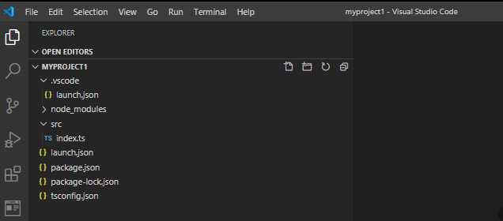
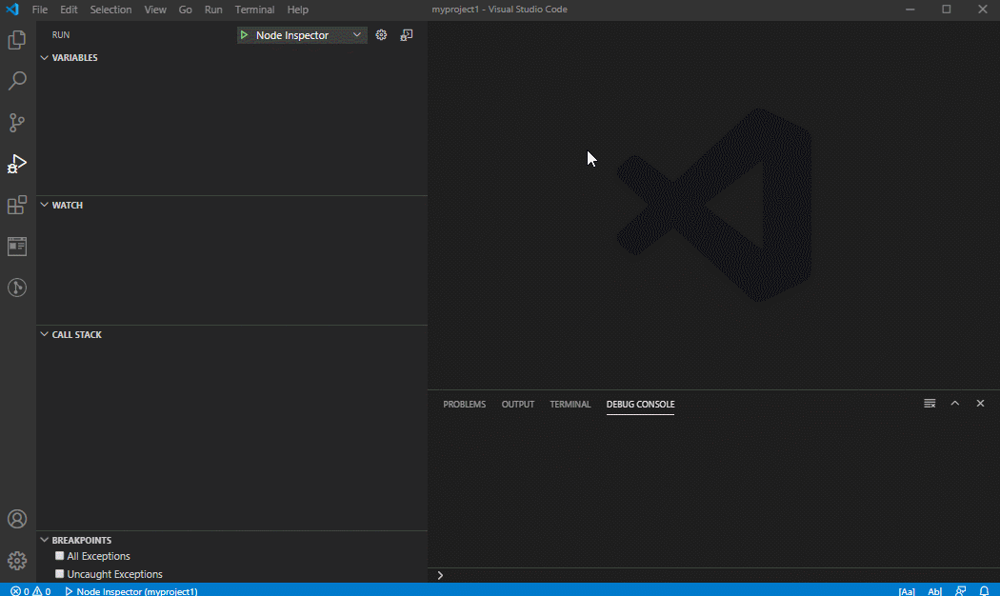
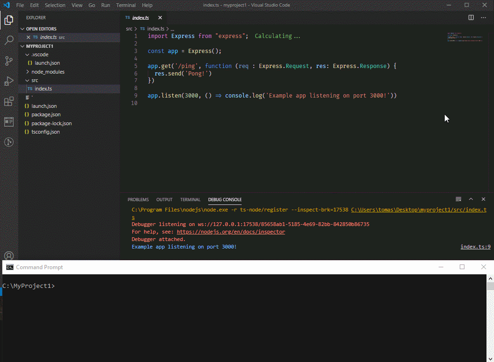

This document describes, in brief, the steps you need to take to setup an empty TypeScript project with support for debugging without transpiling:

* In vscode (with debugger including breakpoints and variable evaluation)
* At commandline using nodemon

Again - this will be done **without transpiling**. Also this article does not cover how to release a Typescript project, or how to use ```tsc```.

## Prerequisites

There are *so* many ways to setup a project, and this will only be a basic setup. You need to install ```vscode``` and ```npm``` before continuing. You also need a command prompt of some kind.

## Initializing the project

Create a folder and initialize the project.

```bash
mkdir myproject
cd myproject
npm init -y
```

This will produce the file ```package.json``` with default settings.

## Start vscode?

Already now you can start vscode and follow the changes in the directories. This will start vscode and open current directory as the project:

```bash
code .
```

## Add support for Typescript

```bash
npm install typescript -s
```

This will modify ```package.json``` (adding the typescript dependency to the project). Also ```package-lock.json``` and ```node_modules``` are created.

The ```-s``` is used for adding a dependency to the development environment (but not production). This is the same as ```--save-dev```. If you forgot to add this flag when installing, just open  ```package.json``` and move the package from ```Dependencies``` to ```devDependencies```.

## tsc & tsc global install

tsc is the TypeScript "compiler" that *transpiles* from TypeScript to Javascript. Now, this is not really what the goal of this guide is all about, but since since it's commonly used it's good to know it exists.

With the above command it's installed in the node_modules\.bin folder, but I recommend to *also* install it globally.

```bash
npm install tsc -g
```

## Add support for "classic" node development

You need this. Read elsewhere why (it avoids a lot of errors) :)

```bash
npm install @types/node -s
```

## Add support for running without transpiling

It's this easy:

* ```node``` runs javascript directly
* ```ts-node``` runs Typescript directly.

Also - It's *not* recommended to use ```ts-node``` for production.

```bash
npm install ts-node -s
```

## Add typescript config file

```tsconfig.json``` controls basically everything regarding how typescript should behave.

```bash
tsc  --init
```

Leave the contents as is for now - there are changes needed to be done, but let's get the basic stuff running first. This file is processed by (for example) ```vscode```, ```tsc```  and ```ts-node```

### Debugging in vscode

All debugging configurations in vscode is stored in the ```.vscode/launch.json``` file.

```bash
mkdir .vscode
cd .vscode
```

contents:

```json
{
	"version": "0.2.0",
	"configurations": [
		{
			"name": "Debug typescript",
			"type": "node",
			"request": "launch",
			"args": [
				"${workspaceRoot}/src/index.ts"
			],
			"runtimeArgs": [
				"-r",
				"ts-node/register"
			],
			"cwd": "${workspaceRoot}",
			"protocol": "inspector",
			"internalConsoleOptions": "openOnSessionStart",
			"env": {
				"TS_NODE_IGNORE": "false"
			},
			"skipFiles": [
				"<node_internals>/**",
				"${workspaceRoot}/node_modules/**"
			],
			"outputCapture": "std",
		}
	]
}
```

[Credit](https://gist.github.com/cecilemuller/2963155d0f249c1544289b78a1cdd695)

## Create index.ts

Create a new folder named src.

```bash
mkdir src
```

Create the file ```index.ts``` as:

```typescript
import Express from "express";

const app = Express();

app.get('/ping', function (req : Express.Request, res: Express.Response) {
  res.send('Pong!')
})

app.listen(3000, () => console.log('Example app listening on port 3000!'))
````

and install the dependencies and the types

```bash
npm install express
npm install @types/express -s
```

# Checkpoint

If you've done everything correct so far, you'll have something like this:



# Run/Debug in vscode

## Starting index.ts

* ```F10``` to immediately begin stepping code.
* ```F5``` to just debug (you need breakpoints)
* ```F9``` to set a breakpoint at a line.
* ```ctrl-j``` to view "Debug Console" output

If all is good the minimal webserver should be up and running and responding on [http://localhost:3000/ping](http://localhost:3000/ping)



# Run/debug in command line

## Manual run

```ts-node``` is already installed, so the most easy way to start would be:

```bash
ts-node src/index.ts
```

## Add support for automatic restart on changed files

Using ```nodemon``` you can restart on file changed. Begin with installing nodemon (preferrably globally)

```bash
npm install nodemon -g
```

Next, run:

```bash
nodemon --watch src/**/*.ts --watch src/**/*.js --exec ts-node src/index.ts
```

Then try to change index.ts and upon saving, nodemon will restart automatically.



## Saving commands for future use

npm has built in support to add "scripts" to package.json. So modify package.json by adding the "debug" command under scripts as stated below.

Also, while in the file, modify the ```main``` to be ```src/index.ts```.

```json
{
  "name": "MyProject",
  "version": "1.0.0",
  "description": "",
  "main": "src/index.ts",
  "scripts": {
    "test": "echo \"Error: no test specified\" && exit 1",
    "debug": "nodemon --watch src/**/*.ts --watch src/**/*.js --exec ts-node src/index.ts",
  },
  "keywords": [],
  "author": "",
  "license": "ISC",
  "devDependencies": {
    "@types/node": "^14.0.13",
    "ts-node": "^8.10.2",
    "typescript": "^3.9.5"
  },
  "dependencies": {
    "@types/express": "^4.17.6",
    "express": "^4.17.1"
  }
}
```

After this change, you can use this command to run the "script":

```bash
npm run debug
```

## Enjoy

:)
