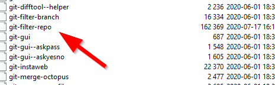

## Install tools

git doesn't have this built in, you need to install the Python script somewhere where git can execute it.

In windows that would be:

```bash
git --exec-path
# answer: C:/Program Files/Git/mingw64/libexec/git-core
```

Next, download the script from the Author [https://github.com/newren/git-filter-repo/blob/main/git-filter-repo](https://github.com/newren/git-filter-repo/blob/main/git-filter-repo).



Install python, if needed.

## Prepare for the change

* Commit all pending changes you have to the remote repo.
* Create a new empty folder.
* Clone the repo ```git clone http://..../something.git```
* Create a mailmap file:

```bash
FirstName NewLastName <new@email.com> FirstName LastName <old.email@none.com>
```

* Run it:

```bash
git filter-repo --mailmap mailmap

# View the result
gitk
```

## But git filter-branch then?

Do not use, it's been reported as depricated. But if you're a single developer and has a simple setup, the result is looking better than filter-repo.

:!: This script replaces *all* commits with the email & author.

```bash
git filter-branch -f --env-filter "GIT_AUTHOR_NAME='Newname'; GIT_AUTHOR_EMAIL='new@email'; GIT_COMMITTER_NAME='Newname'; GIT_COMMITTER_EMAIL='new@email';" HEAD

# View the result
gitk

# Push to remote
git push --force --tags origin 'refs/heads/master'
```

## Enjoy

:)
