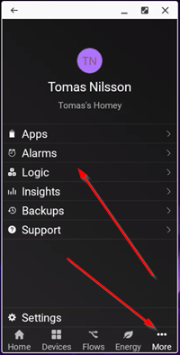
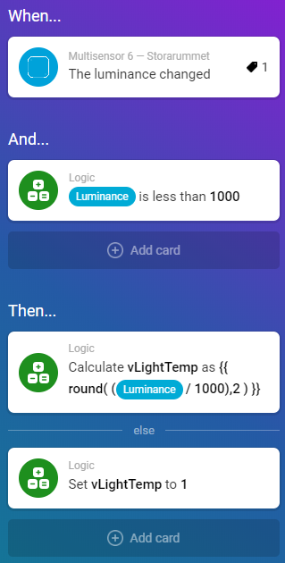
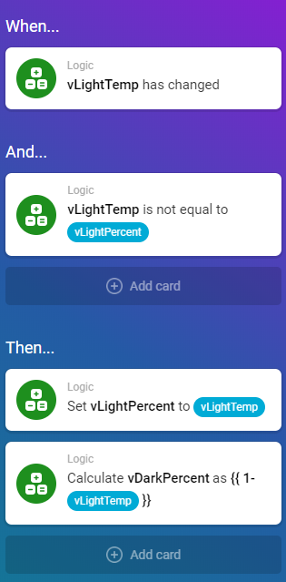
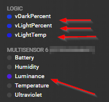
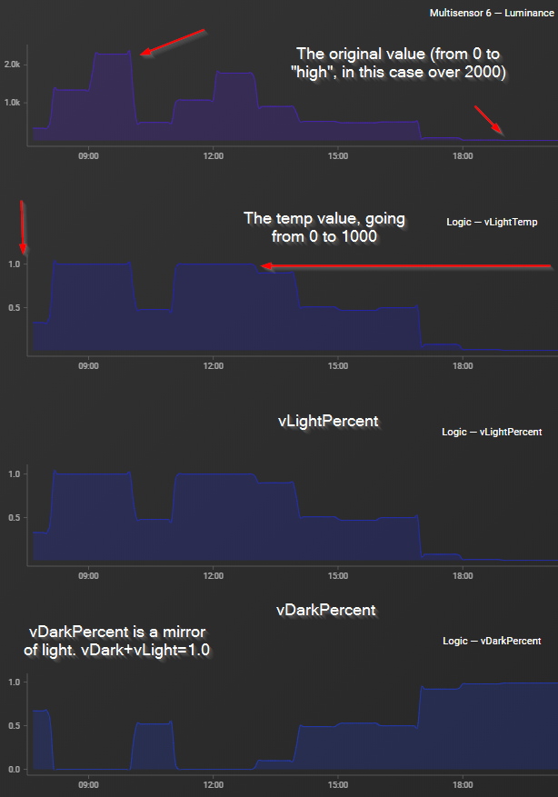

## Create the needed variables

Go to More ==> Logic ==> and add the following three variables as numbers. Set all three to 0 (they will be overwritten by the flow anyway)

* vLightTemp
* vLightPercent
* vDarkPercent



## Measuring the light:

Let's store the measured luminance in a the variable "vLightTemp". This variable will go from 0 to 1.0. In terms of hardware, the MultiSensor 6 works great.



:!: Important note on adding the flows. Do this from the phone! It will not work to create the scripts on your PC.

:!: Anything over 1000 lumens outside will be ignored (since 1000 lumens basically means it's really bright outside, eg 100% bright). If you prefer some other value, change in the *two* places of this script.

:!: The round(number,2) menas it should store the resulting number with two decimals. This is importand it's two. Three will not work.

## If there is an actual change, populate the destination variables

Compare the newly measured light with the current known value. If there's a difference, then update (and, in turn, execute all flows dependent on this variable).

At the same time, calculate vDarkPercent (so if it's full daylight, vBrightPercent will be 100% and vDarkPercent will be 0%).

:!: This little trick avoid small changes in the luminance (eg going from 10 to 12) to trigger dependent flows.



:!: For the step of calculating vDarkPercent, you *must* use vLightTemp. If you use vLightPercent you will get the wrong number (basically the old value will be used, making sure vDarkPercent is always one step behind)

## See the variables in action

Go to [Insights](https://insights.homey.app/) and tick:



Then look at the graphs, they should look something like this (over time):



## Debugging

Send a message to Slack and view any variables there, or view all the variables on [API Playground](https://developer.athom.com/tools/api-playground) and run the following script:

```javascript
Homey.logic.getVariables()
```

## Enjoy

:)
