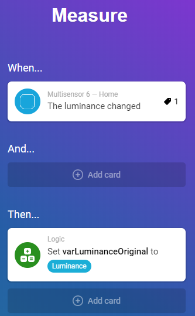
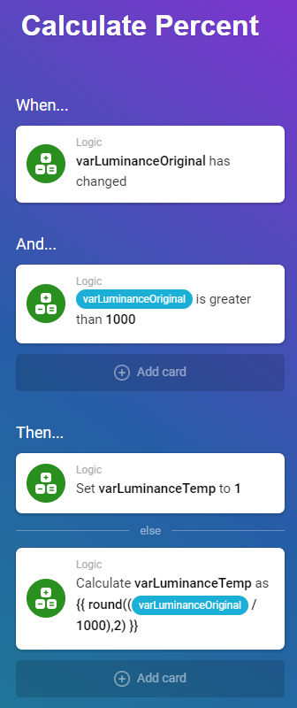
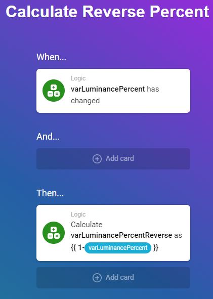
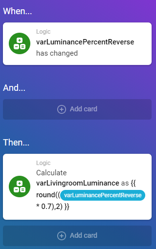

This document describes how to measure luminance, and using it - creating a relative value from 0 to 100% brightness.

I would recommend to also calculate the reverse (eg, the brighter outdoors, the less should your lights turn on).

## Create the variables

You need to create the following variables:

* varLuminanceOriginal (the measured number, in something between 0 to infinity)
* varLuminanceTemp (just for calculation)
* varLuminancePercent (will be between 0 and 100)
* varLuminancePercentReverse (will go from 100 to 0)

## Store the measured luminance

Store the measured luminance (can be anyfrom from 0 to 3-4000) in a the variable "varLuminanceOriginal"

`!` - In terms of hardware, the MultiSensor 6 works great.

## Upon change, do the math

If the "varLuminanceOriginal" variable is between 0 and 1000, create a reflecting number between 0 and 100 (=percent) and store it into the variable "varLuminanceTemp"

Anything over 1000 lumens outside will be ignored (since 1000 lumens basically means it's really bright outside, eg 100% bright)

## Only trigger if changed

Since luminance in theory can change slightly (eg from 1000 to 1004) without affecting the number of percent (100% -> 100%) and we don't want to overtrigger flows we only store the value if it's changed (for example going from 99% to 100%).

## Reverse

It can be quite useful to have a number going from 100 to 0 (the brighter it is, the lesser value).

## Setting up limits (for example, 70%)

Some lamps get hot when running on 100%, but it's very possible to make an additional variable which doesn't go higher than for example 70%. Just take the percent calculated above and multiply with 0.7. Example:

