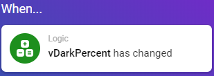
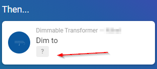
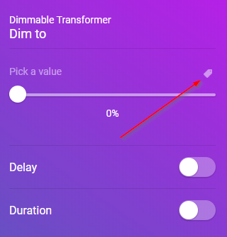
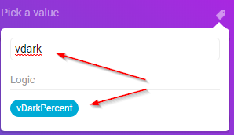
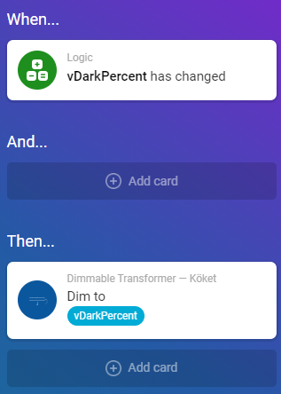
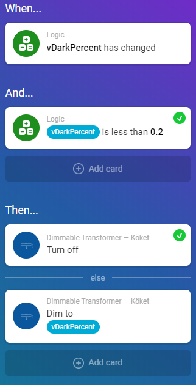

## Prerequisites

You need a variable going from 0 (when there's no dark outdoors) to 1 (when "it's night"). Read the article about how to create the needed variables on this site.

## What to expect

By following this article you will get a dimmable light to be off during daytime and to increase light more and more (the darker it gets outside).

## Setup the flow

Add a when:

and a then:

:!: Use "Dim To" - not "Set relative dim-level"

Using the variable is as easy as this:

## The finished flow

This will do the job :)

## Setting manual thresholds

It's possible to add additional controls using "and". As an example, when we have "some darkness" ( 20%) then we want to dim the lights accordingly to vDarkPercent (and if the darkness is 0-20%, then just keep the lamps off):

## Enjoy

:)
