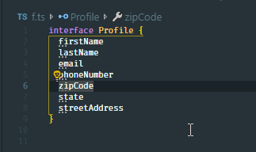

# Shortcuts

## Search + open file


```ctrl-p``` + the name of the file.

## Reformatting

### Join lines


```editor.action.joinLines```

## Multiple edits

### Rename all

```F2```

### Add cursor



Ctrl + Alt + Up arrow / Down arrow


### Multiselect word

```ctrl-d + ctrl-d```

## Go to symbol 

### In file

```ctrl-shift-o``` (try writing a function name)

### In workspace

```ctrl-t```

