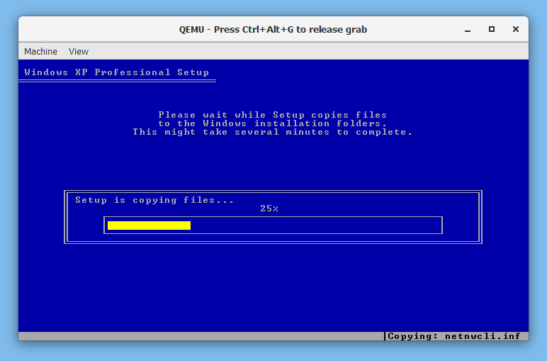

## Install and some tips

Download and install from [https://qemu.weilnetz.de/w64/](https://qemu.weilnetz.de/w64/)

(!) Running qemu on Windows is slow because simulates a cpu (even x86 - it does not make use of Intel Virtualization Technology). Additional tools can be installed to fix this (google it)

## Creating a new blank Virtual Machine

qcow2 or raw are the most commly used formats, but qemu supports several more.

(!) qcow2 is by default thin provisioned (meaning the file will be less than 200Mb and automatically grow to the specified size)

Pick one of the following (qcow2 or raw is recommended).

```cmd
qemu-img create -f qcow2 harddrive.qcow2 30G
qemu-img create -f raw harddrive.raw 30G
qemu-img create -f vmdk harddrive.vmdk 30G
```

Read more from the official [documentation](https://qemu.weilnetz.de/doc/qemu-doc.html#qemu_005fimg_005finvocation).

## Booting

Which emulator to use depends on the ISO you intend to boot, but booting an x86 emulator with 1Gb of memory is:

```cmd
qemu-system-x86_64w.exe -boot d -cdrom "filename.iso" -m 1G harddrive.qcow2
```

It takes some few seconds for the window to open.



# Using

* ```ctrl-alt-G``` releases the cursor from the window
