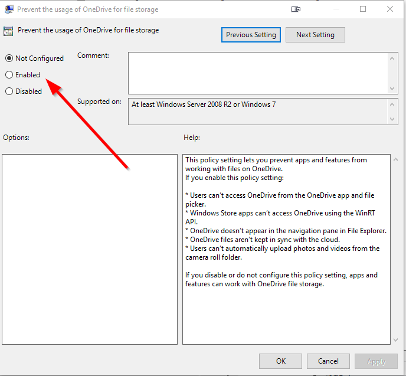

# 2017-06-17 Disable OneDrive using GPO

1. Press Windows-R and open ```GPedit.msc```.
2. Navigate to Local Computer Policy -> Computer Configuration -> Administrative Templates -> Windows Components -> OneDrive.
3. Doubleclick "Prevent the usage of OneDrive for file storage."
4. Set to Disabled.


