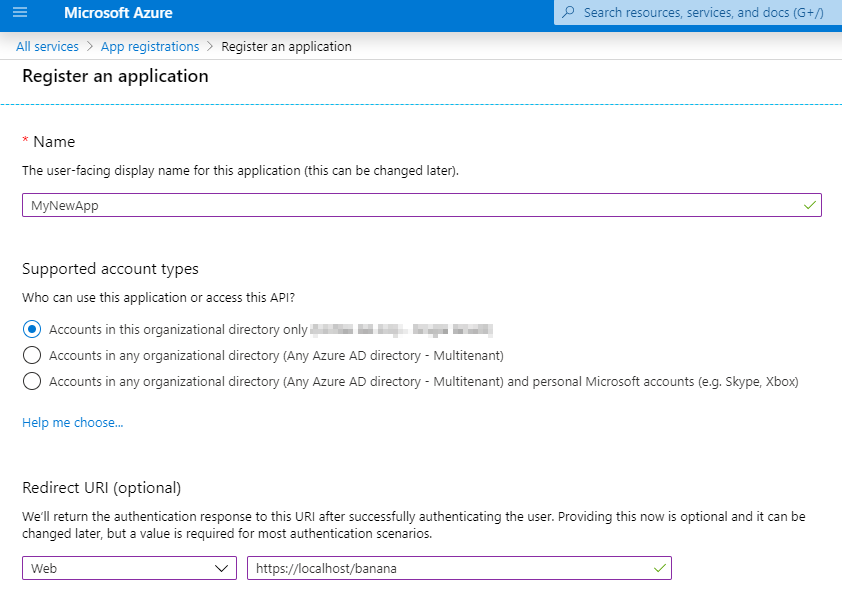
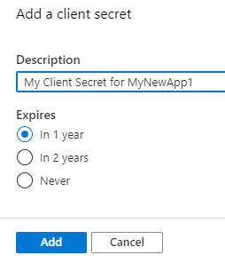
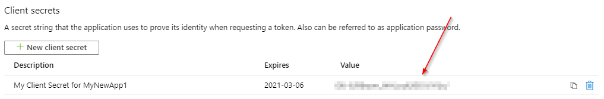
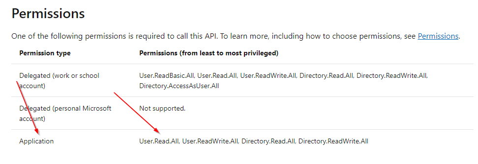
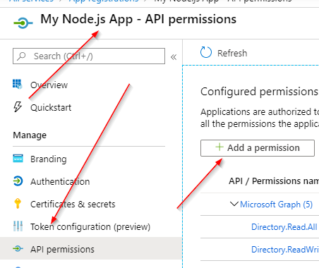
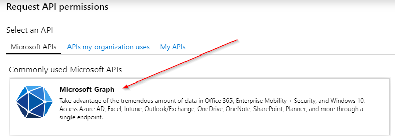
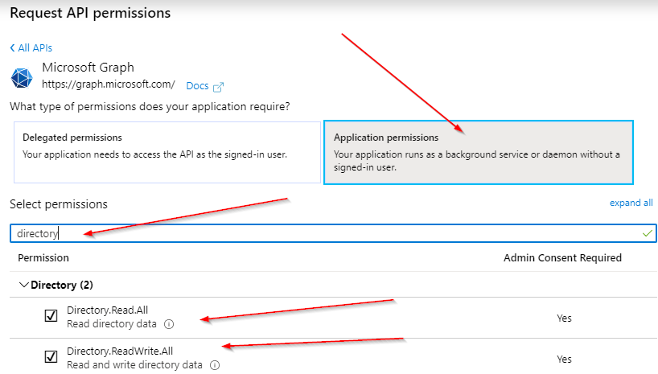
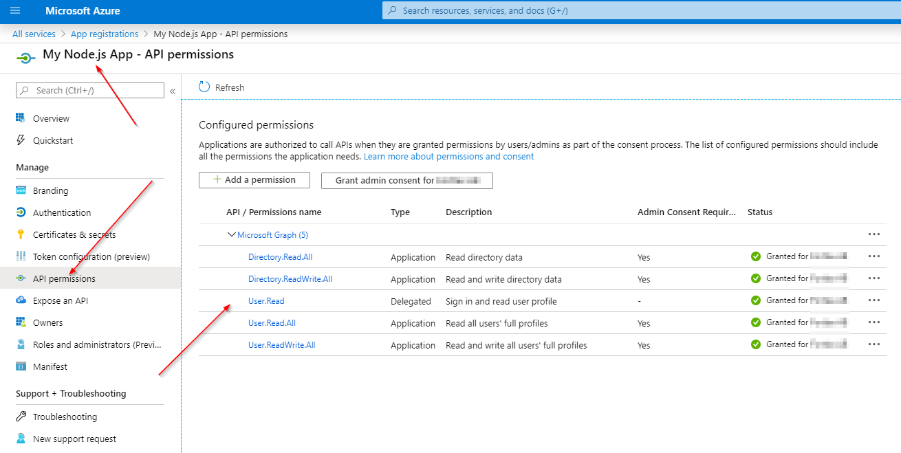

### Application Logon

Applications needs to be webapps (more or less) since the login function is working best if you redirect to Microsoft (which, after successful login, redirects back to your app). If you intend to write an naitive app you will have increased challenges with Two Factor Authentiction.

To logon as an APP first registrate it at Microsoft.com as follows:

1. Go to [https://portal.azure.com/](https://portal.azure.com/)
2. In the search box, enter "App registrations". You will end up [here](https://portal.azure.com/#blade/Microsoft_AAD_RegisteredApps/ApplicationsListBlade)
3. Click "new registration" and give your app a name
4. Enter an return URL which will be called on successful authentication



### Setting application password

1. Click "Certificates & Secrets"
2. Click "New Client Secret"



1. Copy the value! You will only be able to do this now.



### Application permissions

Now you've only given the most basic access rights. If your app needs more then go to "Api Permissions" and grant needed rights.

### All information that you need

Now you have the application password, the application ID, tenant ID and a list of interesting services you can call.


### Login to graph.microsoft.com

```http
POST https://login.microsoftonline.com/{{TenantId}}/oauth2/v2.0/token
Content-Type:application/x-www-form-urlencoded

grant_type:client_credentials&client_id:{{ClientId}}&client_secret:{{ClientSecret}}&scope:https://graph.microsoft.com/.default
```

The response will be:

```json
{
    "token_type": "Bearer",
    "expires_in": 3599,
    "ext_expires_in": 3599,
    "access_token": "THE_TOKEN"
}
```

### Fetching all users in the org

#### Grant rights

First grant needed rights. For each call you intend to make, ensure you have the correct rights first. The required rights for accessing ```/users``` can be found [here](https://docs.microsoft.com/en-us/graph/api/user-list)



Go to [your app](https://portal.azure.com/#blade/Microsoft_AAD_RegisteredApps/ApplicationsListBlade) and add the reflecting permissions:







It will look like this when finished:



#### Make the call

```http
GET https://graph.microsoft.com/v1.0/users
Authorization: Bearer THE_TOKEN
```

### Enjoy

:)
