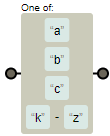

# 2020-03-02 Regex notes from the field

## The most important about regex

It's hard to read, but by visualizing it, it will become understandable. I strongly recommend [https://regexper.com/](https://regexper.com/).

### Example

```text
^hello, (world|moon)\\.$
```


## The regex basics

| **Character** | **Description**                                                                                                | **Example**         | **Result**                   |
| ------------- | -------------------------------------------------------------------------------------------------------------- | ------------------- | ---------------------------- |
| \             | Escapes the next character (so \\n matches newline)                                                            | \\n                 |  |
| ^             | Matches the beginning of input                                                                                 | ^hello              |  |
| $             | Matches the end of input.                                                                                      | hello$              |  |
| *             | Matches the previous character zero or more times. "te*" will match "te", "tee", "teee", "teeee" and so forth. | te*                 |  |
| .             | Matches any single character                                                                                   | hel.o               |  |
| .\            | Matches any string from zero character to "unlimited length".                                                  | hel.*o              |  |
| +             | As with *it matches the previous character, but*one* or more times.                                            | hel+o               |  |
| ?             | Matches a single character zero or one time.                                                                   | hel?o               |  |
| x\|y          | Matches either x or y                                                                                          | hi\|goodbye         |  |
| (x\|y)        | Matches either x or y                                                                                          | (hey\|hello) world! |  |
| [xyz]         | Matches any one of the characters inside of the brackets. Ranges are possible.                                 | [abck-z]            |  |
| \d            | Matches a digit. Equivalent to [0-9].                                                                          |

## More examples

* /\\(([^)]+)\\)/
* ^.*$
* ^[A-C][a-zA-Z0-9]{4}$
* {([A-Za-z]+)+([a-z]+)}
* ^\\w$

Try them all in [https://regexper.com/](https://regexper.com/).

## Learn it!

There's tons of resources for learning rexex, for example this one:

* [https://regexone.com/](https://regexone.com/)
