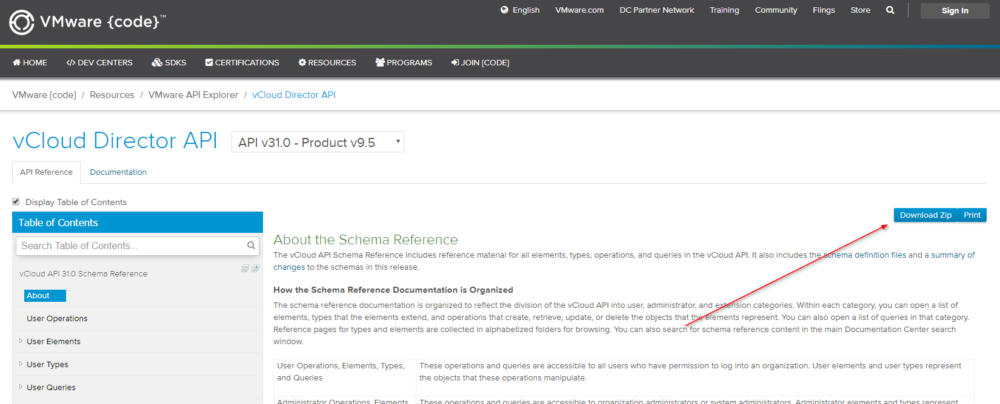

# 2019-09-09 vCloud API - A first look

This document describes some basic operations to get you started.

## Overview

A vCloud instance contains of several servers working together. The minimal setup is several nodes of ESX + vCenter + a vCloud server. Managing the system is mainly done through the vCloud API.

### Admin vs user

Be aware that the the API exists in two flavours; the standard mode and admin mode. These two calls are both valid, but the admin call will return more information than the basic call (if logged in with the same credentials). Of course you can only reach the admin calls if you have right to do so.

```http
https://vdc.company.com/api/org/ORGID
https://vdc.company.com/api/admin/org/ORGID
```

### Swagger

There is a swagger, but it lacks a lot of information, so it's better just to ignore it. Still, if you want to access it, it can be found at:

```http
https://vdc.company.com/api-explorer/
```

### General information about the calling the API

This is an important section, read it thoroughly.

1. Submitting a payload can be either XML or JSON (more and more calls are available as JSON).
   * **This is important:** For XML the *order of the tags* is important. Follow the documentation closely.
1. Submitting a XML requires to have the exact right content-type.
1. Assume (most of the time) that the full XML document must be submitted and not just the part you intend to change.
1. Login with local accounts are used with the syntax "user-name@System"
1. Loggin in with tenant accounts are used with the syntax "user@tenantname"

## Authorization

To establish a session, post the username and password to /api/sessions.

```curl
curl -i -k -H "Accept:application/*+xml;version=31.0" -u "user-name@System:password" -X POST https://vdc.company.com/api/sessions
```

What you're looking for is stored in the http *headers* (not the XML body)

```text
x-vcloud-authorization: THE_TOKEN
```

## Get a list of vCloud Organisations

This call will return a OrgList, which is a fantastic starting point for many operations.

### As JSON

```bash
curl -i -k -X GET -H "Content-Type:application/json" -H "Accept:application/*+json;version=31.0" -H "x-vcloud-authorization: THE_TOKEN" https://vdc.comnpany.com/api/org/
```

### As XML

```bash
curl -i -k -X GET -H "Content-Type:application/json" -H "Accept:application/*+xml;version=31.0" -H "x-vcloud-authorization: THE_TOKEN" https://vdc.comnpany.com/api/org/
```

### Fetching an organisation

From the list of organisations, you will find links to follow. Just use one of them

```bash
curl -X GET \
  https://vdc.company.com/api/org/THEORGID \
  -H 'Accept: application/*+json;version=31.0' \
  -H 'x-vcloud-authorization: THE_TOKEN'
```

### rel?

Many calls will contain links to various operations within vCloud. Understanding how they work is *crucial* in order to code efficiently towards the API.

#### Down

For example fetching an org with atleast one vdc will contain somwthing like this:

```json
   {
      "otherAttributes": {},
      "href": "https://vdc.company.com/api/vdc/THEORGID",
      "id": null,
      "name": "THE_VDC_NAME",
      "type": "application/vnd.vmware.vcloud.vdc+xml",
      "rel": "down",
      "vcloudExtension": []
    },
```

So following this link "down" will give information about the vdc. What you will expect to be returned is of type "application/vnd.vmware.vcloud.vdc+xml" (and the actual type will differ depending on what you send in the HTTP Accept header.)

#### Add

Another example would be:

```xml
    <Link rel="add" href="https://vdc.company.com/api/admin/org/THEORGID/users" type="application/vnd.vmware.admin.user+xml"/>
```

Following this link will "add" to the "users". The body should be of type "application/vnd.vmware.admin.user+xml" and method is most likely POST.

#### Remove

```xml
 <Link rel="remove" href="https://vdc.company.com/api/admin/org/THEORGID"/>
```

Following this link will remove the org.

#### More

There are more:

* edit
* up (will go to the parent)
* enable (will enable/disable)
* alternate (an alternate view on the current data)

.. and so forth. *Far* from all operations are exposed as links, but some of the common ones are.

## More information?

* [All guides and documentation](https://docs.vmware.com/en/vCloud-Director/index.html)
* [vCloud API 27.0](https://www.cloud4y.ru/api/vcloud_sp_api_guide_27_0.pdf)
* [vCloud API 30.0](https://vdc-download.vmware.com/vmwb-repository/dcr-public/1b6cf07d-adb3-4dba-8c47-9c1c92b04857/241956dd-e128-4fcc-8131-bf66e1edd895/vcloud_sp_api_guide_30_0.pdf)

Also, download [these files](https://code.vmware.com/apis/442/vcloud-director) for local search:


